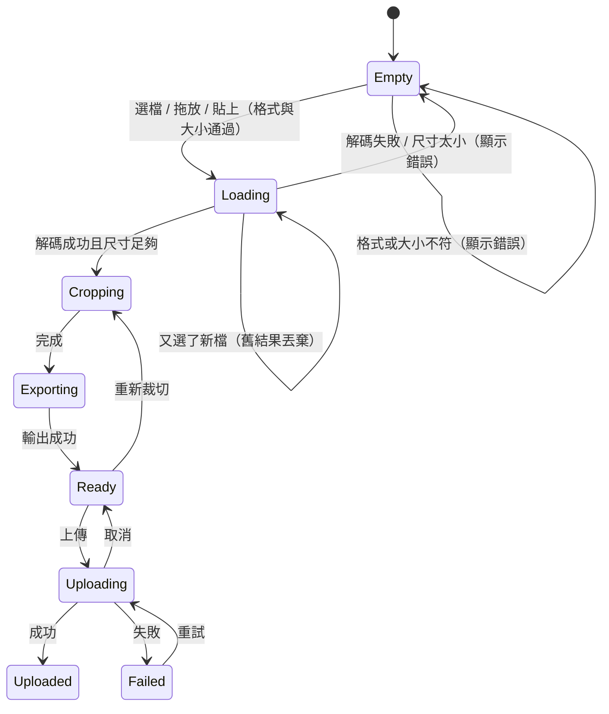

# PRD：大頭貼上傳裁切（avatar-cropper）

## 目標
換大頭貼是每個 App 都有的流程：選照片、拖曳縮放對好臉、裁成圓形、壓縮後上傳。展示瀏覽器端的檔案與影像處理：File API、拖放與貼上、object URL 生命週期、Pointer Events 拖曳與雙指縮放、以焦點為中心的縮放數學、Canvas 輸出與在檔案大小預算內調整壓縮品質，以及可取消、可重試、有進度的上傳。不使用任何裁切套件。

## 關鍵決策
| 決策 | 選擇 | 理由 |
| --- | --- | --- |
| 裁切狀態 | `{ scale, x, y }`：圖片左上角在裁切框座標系的位置與縮放；所有互動都是純函式 `clamp(pan/zoomAt(state))` | 可單元測試；圖片永遠蓋滿裁切框，不會露出空白 |
| 即時預覽 | 以 CSS `transform` 顯示（不重繪 canvas），只有按「完成」才用 canvas 輸出 | 拖曳時只改 transform，不觸發 layout |
| 輸出 | 512×512，優先 WebP，不支援時 JPEG；品質從 0.92 往下試，直到 ≤ 200KB（最低 0.5） | 大頭貼顯示最大 128px，512 足夠 Retina；上傳量可控 |
| 上傳 | mock 上傳以計時器模擬進度，介面與 XHR `upload.onprogress` 相同；`AbortController` 取消 | `fetch` 沒有上傳進度；demo 不依賴後端 |

## 範圍
- **Must**
  - 選擇圖片：按鈕開啟檔案選擇（`accept="image/jpeg,image/png,image/webp"`）、拖放到框內、在頁面上 `Ctrl+V` 貼上圖片。多個檔案時只取第一個圖片檔。
  - 驗證：格式限 JPEG / PNG / WebP；檔案 ≤ 10MB；解碼後寬高皆 ≥ 200px；解碼失敗（損毀檔、副檔名造假）顯示「無法讀取這張圖片」。
  - 裁切框 280×280（窄螢幕依寬度縮小），圓形遮罩；載入時縮放到剛好蓋滿並置中。
  - 互動：
    - 滑鼠 / 觸控拖曳平移（Pointer Events + `setPointerCapture`）。
    - 雙指縮放，以兩指中點為中心。
    - 滑鼠滾輪以游標位置為中心縮放（`passive: false` 並 `preventDefault` 避免頁面捲動）。
    - 縮放 slider：最小（剛好蓋滿）到 4 倍，以裁切框中心縮放。
    - 鍵盤（裁切框 `tabindex="0"`，以 `aria-describedby` 說明操作方式）：方向鍵平移 10px（Shift 50px）、`+` / `-` 縮放 10%、`0` 重設。
    - 任何操作後都 clamp：圖片永遠蓋滿裁切框。
  - 即時預覽：128 / 64 / 32px 三種尺寸的圓形預覽。
  - 完成：輸出 512×512 圖片，顯示格式、尺寸、檔案大小與原始大小（「WebP 512×512・86 KB（原始 3.2 MB）」）。
  - 上傳：顯示進度條（`<progress>`）與百分比；可取消；失敗時顯示錯誤與「重試」；成功後顯示「已更新大頭貼」。
  - 資源清理：替換圖片、重新裁切、unmount 時 `URL.revokeObjectURL`；上傳中 unmount 時 abort。
- **Should**
  - 上傳失敗率可調（Demo 控制）。
  - 「重新選擇」與「重新裁切」按鈕。
- **Won't**
  - 旋轉、濾鏡、多張上傳、EXIF 資訊移除（現代瀏覽器解碼時已套用 EXIF 方向）、HEIC 支援。
  - 真實上傳後端。

## 使用情境
- 身為使用者，我想要直接從桌面把照片拖進來，以便不用找檔案。
- 身為手機使用者，我想要用兩指縮放對好臉，以便大頭貼不會只露出半張臉。
- 身為網路慢的使用者，我想要看到上傳進度並可以取消，以便不用乾等。
- 身為使用者，我想要看到拖曳時畫面不卡、圖片永遠不會拖出框外。

## 狀態與流程

## 資料與介面
- 純函式：
  - `utils/crop.ts`：`coverScale(image, viewport)`、`initialCrop(image, viewport)`、`clampCrop(state, image, viewport)`、`panCrop(state, dx, dy, ...)`、`zoomCropAt(state, nextScale, focusX, focusY, ...)`、`sourceRect(state, viewport) => { sx, sy, size }`。
  - `utils/file.ts`：`validateFile(file) => string | null`、`validateDimensions(size) => string | null`、`firstImageFile(files) => File | null`、`formatBytes(bytes)`。
  - `utils/encode.ts`：`encodeWithinBudget(encode: (quality) => Promise<Blob | null>, { maxBytes, qualities }) => Promise<{ blob, quality, withinBudget }>`、`exportCrop(source, rect, size) => Promise<Blob>`（canvas，WebP 不支援時退回 JPEG）。
- Service：`services/mockUpload.ts`：`createMockUploader({ failureRate, random, chunk, interval }) => (blob, { signal, onProgress }) => Promise<{ url }>`。
- Composable：
  - `useImageSource(loadImage?) => { state, image, error, load(file), clear() }`：管理 object URL，較舊的載入結果丟棄。
  - `useCropper(image: Ref<ImageSize | null>, viewport: Ref<number>) => { crop, minScale, maxScale, zoom, setZoom, onPointerDown/Move/Up, onWheel, onKeydown, reset, transform }`。
  - `useUpload(upload) => { status, progress, error, start(blob), cancel(), retry() }`。
- 元件：`AvatarCropperApp.vue`、`DropZone.vue`、`CropViewport.vue`、`AvatarPreview.vue`、`UploadPanel.vue`。
- 相依套件：無新增。

## 邊界情況
| 編號 | 情境 | 預期行為 |
|------|------|----------|
| EC-01 | 選到 GIF、PDF、HEIC | 顯示「只支援 JPEG、PNG、WebP」，不載入 |
| EC-02 | 檔案 > 10MB | 顯示「檔案超過 10 MB（目前 12.3 MB）」 |
| EC-03 | 圖片 150×800 | 顯示「圖片至少要 200×200 px」 |
| EC-04 | 檔案損毀或副檔名造假 | 顯示「無法讀取這張圖片」，並釋放 object URL |
| EC-05 | 第一張還在解碼時選了第二張 | 只顯示第二張，第一張的 object URL 被釋放 |
| EC-06 | 直式 1000×2000 圖片、裁切框 280 | 最小縮放 0.28，水平剛好蓋滿、垂直置中 |
| EC-07 | 拖曳超出邊界 | clamp 後圖片邊緣剛好貼齊裁切框，不露白 |
| EC-08 | 以游標 / 雙指中點縮放 | 焦點下的圖片像素在縮放前後不動（clamp 未介入時） |
| EC-09 | 縮小到比最小還小、放大超過 4 倍 | 夾在範圍內 |
| EC-10 | 拖放多個檔案或非圖片 | 取第一個圖片；都不是圖片時顯示錯誤 |
| EC-11 | 貼上的內容不是圖片（純文字） | 不處理，不顯示錯誤 |
| EC-12 | 壓縮到最低品質仍 > 200KB | 仍輸出最低品質結果並標示「超過建議大小」 |
| EC-13 | 瀏覽器不支援 WebP 輸出（回傳 PNG） | 改用 JPEG |
| EC-14 | 上傳中按取消 | abort，進度歸零，狀態回到可上傳 |
| EC-15 | 上傳失敗 | 顯示錯誤與「重試」；重試從 0% 開始 |
| EC-16 | 上傳中又按上傳 / 重新裁切 | 上傳按鈕停用；重新裁切會先取消上傳 |
| EC-17 | 滾輪縮放 | 不捲動頁面 |
| EC-18 | unmount | 釋放所有 object URL、abort 上傳、移除 paste listener |

## 非功能需求
- 效能：拖曳時只更新 `transform`（`will-change: transform`），每個 pointermove 只做一次純函式計算；輸出 12MP 照片 < 500ms（主要成本在瀏覽器解碼）。
- 無障礙：拖放區同時是可聚焦的按鈕；裁切框 `tabindex="0"`，`aria-label`「裁切區域」並以 `aria-describedby` 說明鍵盤操作；縮放 slider 有 label 與 `aria-valuetext`「150%」；錯誤以 `role="alert"`；上傳進度以 `<progress>` 與 live region 宣告（每 25% 一次）；拖曳遵守 `prefers-reduced-motion`（無動畫）。
- RWD：≥ 720px 裁切框與預覽左右排列；窄螢幕上下排列，裁切框寬度 = min(280px, 可用寬度)；觸控目標 ≥ 44px；裁切框設定 `touch-action: none`。

## 驗收標準
- [ ] AC-01：Given 選擇 1000×2000 的 PNG，Then 裁切框顯示圖片剛好蓋滿並置中，縮放 slider 在最小值。
- [ ] AC-02：Given 圖片已載入，When 往右拖 1000px，Then 圖片左緣貼齊裁切框左緣（x = 0）。
- [ ] AC-03：Given 以裁切框中心放大到 2 倍，Then 中心點下的圖片像素不變，`sourceRect` 邊長為原本一半。
- [ ] AC-04：Given 裁切框聚焦，When 按 `→`、`Shift+↓`、`+`、`0`，Then 分別平移 10px、平移 50px、放大 10%、重設。
- [ ] AC-05：Given 按「完成」，Then 輸出 512×512 圖片，大小 ≤ 200KB 時使用第一個可滿足的品質。
- [ ] AC-06：Given 上傳中，Then 進度條遞增；When 按取消，Then 請求 abort、狀態回到可上傳。
- [ ] AC-07：Given 上傳失敗，When 按重試，Then 重新上傳並成功。
- [ ] AC-08：Given 已載入圖片並輸出結果，When unmount，Then 所有建立過的 object URL 都已釋放。
- [ ] AC-09 ~ AC-26：邊界情況 EC-01 ~ EC-18 各自通過。
