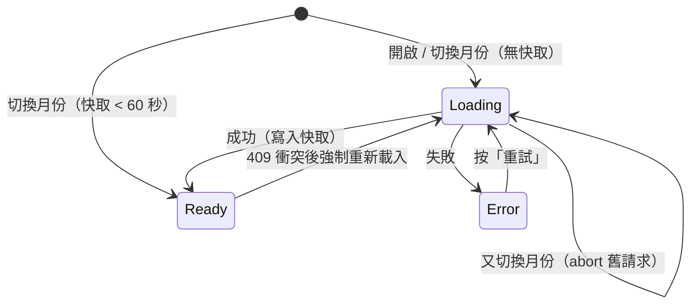
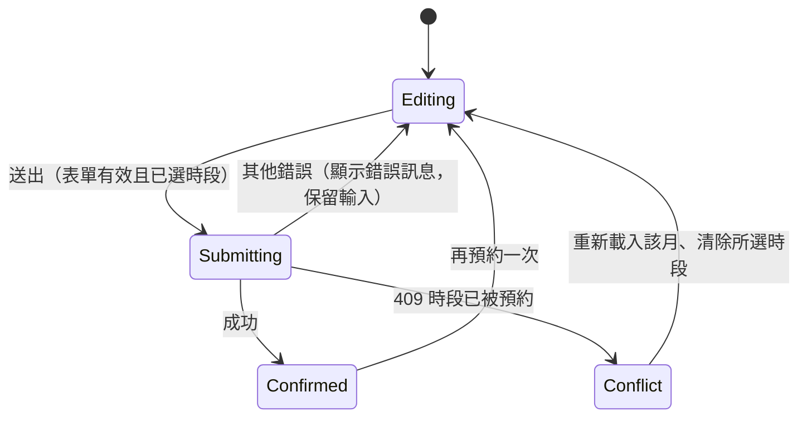

# PRD：預約時段選擇器（booking-slots）

## 目標
以「髮廊線上預約」為情境，展示日常最常見、卻最容易寫錯的日期時間處理：營業時間、公休與例外日、午休、不同服務時長、最短提前時間、店家時區與使用者時區不同。不引入日期套件，以純函式計算可預約時段；日曆依 WAI-ARIA Date Picker Dialog 的 grid 模式實作完整鍵盤導覽；時段資料來自 mock API，處理月份快速切換的競態、快取，以及送出時「時段剛被別人訂走」的衝突。

## 關鍵決策
| 決策 | 選擇 | 理由 |
| --- | --- | --- |
| 日期函式庫 | 不用（不引入 dayjs / date-fns），以 `Intl.DateTimeFormat` 與自寫純函式處理 | 要能說明時區與 DST 的原理，而不是只呼叫套件 |
| 日期表示法 | 日期用 `YYYY-MM-DD` 字串（`PlainDate`），時間用「當日分鐘數」整數；只有與「現在」比較時才轉成 epoch ms | 避免 `new Date('2026-09-21')` 被當成 UTC 午夜而跨日 |
| 時區 | 時段一律以店家時區 `Asia/Taipei` 計算與顯示；使用者時區不同時，時段旁附註當地時間 | 使用者去的是實體店，店家時間才是真的 |
| 時段計算位置 | 前端依營業規則計算候選時段，API 只回傳已被預約的區間 | 規則計算可單元測試；伺服器只負責「誰先訂到」 |
| 流程 | 單頁：選服務 → 選日期 → 選時段 → 填姓名電話 → 確認 | 生活化、步驟少；不做多步驟 wizard |

## 範圍
- **Must**
  - 服務選擇：4 項服務（剪髮 30 分、洗剪 60 分、染髮 120 分、燙髮 150 分），以 radio 卡片呈現；切換服務後保留已選日期，重新計算時段，原時段不再可用時清除並提示。
  - 營業規則（`data/schedule.ts`）：
    - 週二至週五 11:00–20:00、週六日 10:00–19:00，週一公休。
    - 午休 13:00–14:00（每天），服務不可跨越午休。
    - 例外日：指定日期公休（例如國定假日），或指定日期特殊營業時間（例如除夕 10:00–15:00）；例外日覆蓋週規則。
    - 時段粒度 30 分鐘；服務必須在打烊前結束（打烊 20:00 時，150 分服務最晚 17:30 開始）。
    - 最短提前 2 小時（現在 15:10 時，最早 17:30 的時段）；可預約範圍為今天起 30 天（含今天）。
  - 日曆：
    - 月曆 grid，週日為每週第一天；顯示上 / 下月切換；超出可預約範圍的月份切換按鈕 `disabled`。
    - 每一天的狀態：`closed`（公休）、`past`（過去或超出範圍）、`full`（有營業但所選服務已無可用時段）、`available`（顯示剩餘時段數）；只有 `available` 可選。
    - 今天加上「今天」標示；選取日以 `aria-selected="true"` 表示。
  - 鍵盤（WAI-ARIA grid，roving tabindex，只有一格 `tabindex="0"`）：
    - `←` / `→` 前後一天、`↑` / `↓` 前後一週、`Home` / `End` 本週第一 / 最後一天、`PageUp` / `PageDown` 上 / 下個月同日（該月無此日則取月底）、`Enter` / `Space` 選取。
    - 焦點移到其他月份的日期時自動切換月份；焦點可停在不可選的日期（讀出原因），但不能選取。
    - 焦點不可移出可預約範圍（到邊界就停住）。
  - 時段列表：
    - 依上午 / 下午 / 晚上（< 12:00 / 12:00–17:59 / ≥ 18:00）分組，每組為 `<fieldset>`，時段為同名的原生 radio（方向鍵在所有時段間移動並選取），顯示「14:30–15:30」。
    - 已被預約的時段不顯示；整天無可用時段顯示「這天已約滿，試試 <下一個有空的日期>」並提供按鈕跳過去。
    - 使用者時區 ≠ `Asia/Taipei` 時，每個時段附註「你的時間 07:30」，並在列表上方說明以店家時間為準。
  - 可用性 API（`services/mockBookingApi.ts`）：
    - `fetchBookings(month: 'YYYY-MM', signal) => Promise<Booking[]>`，延遲 300–800ms，失敗率可調 0–50%（預設 10%）。
    - 切換月份時 abort 上一個請求；同月份結果快取 60 秒，快取期間切回來不重打 API。
    - 首次開啟以固定種子產生既有預約（每個營業日約 40% 時段被訂），讓畫面有滿有空。
    - 載入中日曆顯示骨架（格子保留、不跳版），失敗時顯示「無法載入空檔」與「重試」按鈕。
  - 送出預約：
    - 表單欄位：姓名（1–20 字，去除前後空白）、手機（台灣格式 `09` 開頭 10 碼，允許輸入 `0912-345-678` 或空格，儲存時去除）；未選時段時送出按鈕 `disabled`。
    - `createBooking(input, signal)`：延遲 500–1000ms；若該時段在送出前已被佔用，回傳 409。
    - 送出中按鈕顯示「預約中…」並 `disabled`，避免重複送出；409 時顯示「這個時段剛被預約走了」，重新載入該月並清除所選時段，保留姓名電話。
    - 成功後顯示確認卡：服務、日期（`2026年9月23日 週三`）、時間、預約編號，以及「加入行事曆」（產生 `.ics` 內容並以 Blob 下載）與「再預約一次」。
  - 「模擬現在時間」控制：可設定現在時間（預設真實時間），方便展示提前 2 小時與跨日邊界；Demo 控制面板另可調 API 失敗率、「下一次送出必定衝突」開關。
- **Should**
  - （未實作）我的預約：成功的預約存在 `localStorage`（key `booking-slots:v1`，`{ version: 1, data }`），列出未來的預約，可取消（確認後釋放該時段）。
  - （未實作）店家時區切換（Demo 控制）：可改為 `America/New_York` 展示 DST 當天（2026-11-01）時段計算正確。
  - （未實作）所選服務、日期寫入 URL query（`?service=cut&date=2026-09-23`），重新整理後還原；非法值忽略。
- **Won't**
  - 多位設計師、多資源排程、候補名單。
  - 真實後端、登入、簡訊驗證、付款訂金。
  - 週視圖、拖拉選時段、重複預約。
  - 日期套件、UI 元件庫的 DatePicker。

## 使用情境
- 身為上班族，我想要看一眼就知道哪幾天還有空，以便挑下班後的時段。
- 身為要染髮的客人，我想要只看到放得下 120 分鐘的時段，以便不會約了之後被店家打電話改時間。
- 身為人在美國的留學生，我想要同時看到店家時間與我的當地時間，以便幫家人預約不會算錯。
- 身為鍵盤使用者，我想要用方向鍵與 PageDown 在日曆中移動，以便不用滑鼠完成預約。
- 身為使用者，我想要在兩次點擊之間快速切換月份，以便確認畫面不會被舊回應覆蓋。

## 狀態與流程
可用性載入（每個月份）：


送出預約：


## 資料與介面
- 相依套件：無新增。
- 型別（`types.ts`）：
  ```ts
  type PlainDate = string             // 'YYYY-MM-DD'
  type YearMonth = string             // 'YYYY-MM'
  type Minutes = number               // 當日分鐘數，0–1440
  interface Service { id: 'cut' | 'wash-cut' | 'color' | 'perm'; name: string; duration: Minutes; price: number }
  interface OpenRange { start: Minutes; end: Minutes }           // 半開區間，午休以兩段區間表示
  interface DateException { ranges: OpenRange[]; note: string }  // 空陣列 = 公休，覆蓋週規則
  interface Schedule {
    timeZone: string; slotStep: Minutes; leadTime: Minutes; bookingDays: number
    weekly: OpenRange[][]                         // 以 weekday（0 = 週日）為索引
    exceptions: Record<PlainDate, DateException>
  }
  interface Booking { id: string; date: PlainDate; start: Minutes; end: Minutes }
  interface Slot { date: PlainDate; start: Minutes; end: Minutes }
  interface DayInfo { status: 'closed' | 'past' | 'full' | 'available'; count: number; note?: string }
  interface BookingApi {
    fetchBookings(month: YearMonth, signal: AbortSignal): Promise<Booking[]>
    createBooking(input: BookingInput, signal: AbortSignal): Promise<ConfirmedBooking>  // 409 時 reject BookingConflictError
  }
  ```
- 純函式（`utils/plainDate.ts`）：`addDays`、`diffDays`、`addMonths`（月底夾住）、`weekday`、`daysInMonth`、`monthGrid(ym) => PlainDate[][]`（6 週 × 7 天，含前後月補位）、`startOfWeek` / `endOfWeek`、`clampDate`、`isPlainDate`。
- 純函式（`utils/timeZone.ts`）：`zonedTime(epochMs, timeZone) => { date, minutes }`、`offsetMinutes(epochMs, timeZone)`、`zonedToEpoch(date, minutes, timeZone) => number | null`（DST 缺口回傳 `null`，重疊只回傳一個時間點）。
- 純函式（`utils/slots.ts`）：`openRangesFor`、`bookingWindow`、`earliestStart`、`overlaps`、`computeSlots({ date, duration, schedule, bookings, now }) => Slot[]`、`dayInfo(...) => DayInfo`、`nextAvailableDate(from, query, getBookings) => PlainDate | null`、`groupSlots(slots) => { morning, afternoon, evening }`。
- 純函式（`utils/phone.ts`）：`normalizePhone`、`validateName`、`validatePhone`；`utils/ics.ts`：`buildIcs(booking, schedule, { summary, location, stamp }) => string`（時間以 UTC `Z` 格式輸出）、`downloadIcs(content, filename)`。
- Composable：
  - `useCalendarNav(focused, min, max) => { visibleMonth, canPrev, canNext, moveTo, prevMonth, nextMonth, onKeydown(e) => 'moved' | 'select' | 'ignored' }`。
  - `useMonthBookings(month, api, { ttl = 60_000, clock }) => { bookings, status, error, bookingsFor(date), retry, invalidate(month) }`。
  - `useBookingForm(api) => { name, phone, state, errors, valid, submitError, confirmed, submit(slot, serviceId), reset }`。
  - `useNow(override, clock?) => ComputedRef<number>`：對齊整分每分鐘更新；`override` 有值時固定為該時間。
- Mock（`services/mockBookingApi.ts`）：`createMockBookingApi({ schedule, settings?, random?, fetchLatency?, createLatency? })`，`settings` 為 `{ failureRate, forceConflict }`，Demo 控制直接修改；`seedBookings(date, schedule)` 以日期雜湊為種子產生固定的既有預約（約 1/7 的營業日整天約滿）。
- 元件：`BookingApp.vue`（props `api?`、`initialNow?`、`userTimeZone?` 供測試注入）、`ServicePicker.vue`、`CalendarGrid.vue`、`SlotList.vue`、`BookingForm.vue`、`ConfirmationCard.vue`、`DemoControls.vue`。

## 邊界情況
| 編號 | 情境 | 預期行為 |
|------|------|----------|
| EC-01 | 服務時長跨越午休（13:00 開始的 60 分服務） | 不產生該時段；12:00–13:00 可、14:00–15:00 可 |
| EC-02 | 服務超過打烊時間 | 最晚時段的結束時間 = 打烊時間，不產生超出者 |
| EC-03 | 現在時間 15:10，最短提前 2 小時 | 當天最早時段為 17:30（17:10 無條件進位到 30 分粒度） |
| EC-04 | 現在時間 22:30，提前 2 小時跨到明天 00:30 | 今天為 `full` 或 `past`；明天時段不受影響（營業前） |
| EC-05 | 例外日：國定假日公休、除夕短營業 | 例外日覆蓋週規則；公休日顯示 `closed` |
| EC-06 | 既有預約與候選時段部分重疊（預約 15:00–16:00，候選 14:30–15:30） | 候選不可用；相鄰（15:30 結束 / 15:30 開始）可用 |
| EC-07 | 月底日期 PageDown（1/31 到 2 月） | 焦點移到 2/28（或閏年 2/29） |
| EC-08 | 焦點移到下個月的補位格 | `visibleMonth` 切換，焦點仍在同一天 |
| EC-09 | 快速連點「下個月」3 次 | 只有最後一個月的回應被套用，前兩個請求 `signal.aborted` |
| EC-10 | 切回 60 秒內載入過的月份 | 不呼叫 API，立即顯示 |
| EC-11 | API 失敗 | 顯示錯誤與「重試」；不影響已快取月份 |
| EC-12 | 送出時時段已被佔用（409） | 顯示衝突訊息，重新載入該月，清除所選時段，保留姓名電話 |
| EC-13 | 連點「確認預約」 | 只送出一次請求 |
| EC-14 | 切換服務後原時段放不下 | 清除所選時段並以 live region 提示「原本的 14:00 放不下染髮，請重新選擇」 |
| EC-15 | 所選日期整天約滿 | 顯示下一個可預約日期的按鈕；30 天內都滿則顯示「近 30 天已約滿」 |
| EC-16 | 手機輸入 `0912-345-678`、`+886912345678`、`0212345678`、空白 | 前兩者正規化為 `0912345678`；後兩者顯示錯誤 |
| EC-17 | 姓名只有空白或超過 20 字 | 顯示錯誤，不送出 |
| EC-18 | 使用者時區為 `America/Los_Angeles` | 時段仍以台北時間計算；附註的當地時間正確（台北 14:00 = 前一天 23:00，附註「前一天」） |
| EC-19 | 頁面停留跨過午夜或跨過時段 | `useNow` 每分鐘更新，已過去的時段即時消失；所選時段失效時清除並提示 |
| EC-20 | unmount | abort 進行中請求、清除計時器 |
| EC-21 | 店家時區在 DST 切換日（Should） | 不存在的時間不產生時段，重複的時間只產生一次 |

## 非功能需求
- 效能：`computeSlots` 單日 < 0.5ms；整月 42 格的 `dayInfo` 計算 < 5ms；月份切換到畫面更新（有快取）< 16ms。日曆骨架與載入後同尺寸，CLS 為 0。
- 無障礙：
  - 日曆為 `role="grid"`，欄標題為 `role="columnheader"`（`abbr` 為「星期日」等全名）；每格 `aria-label` 如「9月23日 星期三，剩 6 個時段」、「9月22日 星期一，公休」。
  - 月份標題 `aria-live="polite"`，切換月份時讀出「2026年10月」。
  - 時段列表為原生 radio，依上午 / 下午 / 晚上以 `<fieldset>` + `<legend>` 分組。
  - 表單錯誤以 `aria-invalid` 與 `aria-describedby` 連結訊息；409 與服務切換提示以 `role="status"` 宣告。
  - 不以顏色作為唯一狀態提示（公休加斜線、約滿加文字）。
- RWD：≥ 900px 日曆與時段列表左右並排；< 900px 上下排列；最小寬度 360px 時日曆每格至少 44×44px。

## 驗收標準
- [ ] AC-01：Given 週三 11:00–20:00 且無預約，When 選 150 分燙髮，Then 時段為 14:00、14:30 … 17:30 共 8 個，上午沒有任何時段（11:00 開始會在 13:30 結束，跨越午休）。
- [ ] AC-02：Given 現在為週三 15:10，When 選 30 分剪髮並選今天，Then 第一個時段為 17:30。
- [ ] AC-03：Given 週一，When 查看日曆，Then 該格為 `closed`、不可選，`aria-label` 含「公休」。
- [ ] AC-04：Given 焦點在 1 月 31 日，When 按 `PageDown`，Then 焦點移到 2 月 28 日且月份標題為 2 月。
- [ ] AC-05：Given 焦點在某日，When 依序按 `→`、`↓`、`Home`、`End`，Then 焦點依序為 +1 天、+7 天、該週週日、該週週六，且只有焦點格 `tabindex="0"`。
- [ ] AC-06：Given 9 月已載入，When 快速切到 10 月再切到 11 月，Then 10 月請求被 abort，畫面顯示 11 月資料；When 60 秒內切回 9 月，Then API 呼叫次數不變。
- [ ] AC-07：Given 已選時段且表單有效，When 送出且 API 回傳 409，Then 顯示衝突訊息、所選時段被清除、姓名電話保留、該月重新載入。
- [ ] AC-08：Given 送出中，When 再按「確認預約」，Then API 只被呼叫 1 次。
- [ ] AC-09：Given 預約成功，When 產生 `.ics`，Then `DTSTART` 為 UTC（台北 14:00 輸出 `T060000Z`），`DTEND` 依服務時長。
- [ ] AC-10：Given 使用者時區為 `America/Los_Angeles`，When 查看台北 14:00 的時段，Then 附註為「你的時間 前一天 23:00」。
- [ ] AC-11：Given 已選 14:00 洗剪（60 分），When 改選染髮（120 分）且 14:00–16:00 有預約衝突，Then 所選時段清除並出現提示。
- [ ] AC-12：Given 元件已掛載且請求進行中，When unmount，Then 請求 `signal.aborted` 為 `true`，計時器已清除。
- [ ] AC-13 ~ AC-33：邊界情況 EC-01 ~ EC-21 各自通過（EC-21 屬 Should，未實作時標示略過）。
