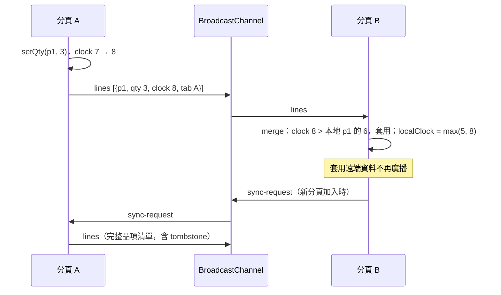
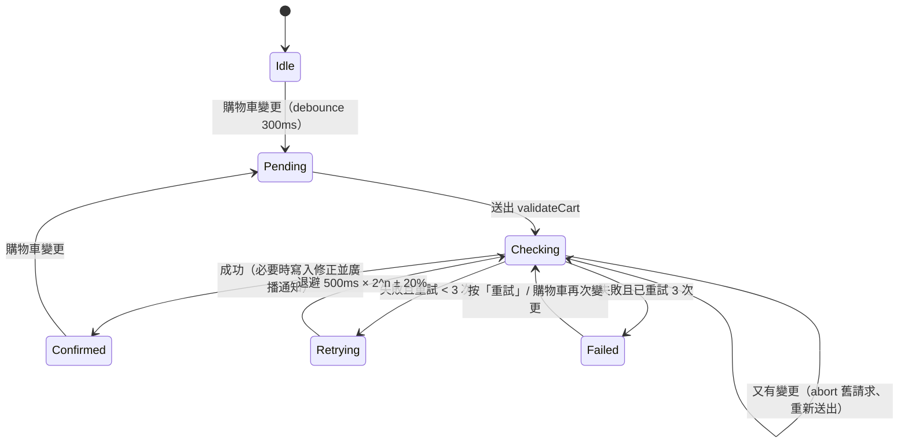
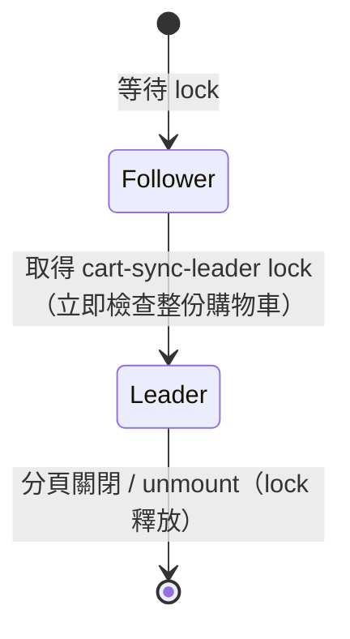

# PRD：跨分頁購物車（cart-sync）

## 目標
展示同一個使用者開多個分頁時，購物車如何保持一致：以 `BroadcastChannel` 即時同步（不支援時退回 `storage` event），衝突以「逐項 Last-Write-Wins + Lamport clock」解決，保證各分頁最終收斂。持久化以自寫 Pinia plugin 實作，庫存檢查走樂觀更新，並用 Web Locks 選出 leader 分頁，只由 leader 呼叫 mock API，避免 N 個分頁重複打請求。補上目前專案缺少的「瀏覽器 API」與「分散式狀態」兩個領域。

## 範圍
- **Must**
  - 商品列表：8 項種子商品（名稱、單價 TWD 整數），每項有「加入購物車」按鈕；已在購物車時數量 +1。
  - 購物車：每列顯示商品名、數量步進器（`−` / `+` / 數字輸入，範圍 1–99）、小計、刪除按鈕；底部顯示總件數與總金額（`Intl.NumberFormat('zh-TW', { style: 'currency', currency: 'TWD', maximumFractionDigits: 0 })`）；「清空」按鈕。
  - 資料模型：每個品項是一個 LWW register，帶 `clock`（Lamport clock）與 `tabId`；刪除不移除資料，而是寫入 `deleted: true` 的 tombstone，讓「刪除」也能參與衝突比較。
  - Lamport clock：本地每次寫入 `clock = localClock + 1`；收到遠端資料時 `localClock = max(localClock, remote.clock)`。比較規則：`clock` 大者勝，相同時 `tabId` 字典序大者勝（全序，保證收斂）。
  - 同步傳輸：`BroadcastChannel('cart-sync')` 廣播變更的品項（不是整份狀態）；不支援時退回監聽 `storage` event 並以 `newValue` 合併。套用遠端資料時不再廣播（避免迴圈）。
  - 新分頁加入：先從 `localStorage` 還原，再廣播 `sync-request`，其他分頁回覆完整品項清單並合併。
  - 持久化 plugin：自寫 Pinia plugin，store 以 option `sync: { key, version, channel, pick, apply, parse }` 啟用；變更後 debounce 100ms 寫入 `localStorage`（key `cart-sync:v1`，格式 `{ version: 1, data }`）；版本不符或解析失敗時捨棄。
  - Leader 選舉：`navigator.locks.request('cart-sync-leader', ...)` 持有不釋放的 lock 即為 leader；leader 分頁關閉時 lock 自動釋放，由下一個等待中的分頁接手，接手後立刻對整份購物車做一次庫存檢查。
  - 樂觀更新與庫存檢查：本地操作立即反映在畫面；leader 在購物車變更後 debounce 300ms 呼叫 mock `validateCart`；庫存不足時以新的 clock 寫入修正後的數量（庫存為 0 則寫入 tombstone），並廣播通知，所有分頁顯示「『<商品>』庫存不足，已調整為 N 件」。
  - Mock 後端：延遲 300–800ms，失敗率可調 0–50%（預設 10%）；庫存存在 `localStorage`（key `cart-sync:server:v1`）模擬所有分頁共用的伺服器；控制面板可調整每項商品庫存（0–20）。
  - 重試：API 失敗時指數退避重試 3 次，延遲 `500ms × 2^n`，加 ±20% jitter；3 次都失敗則狀態為「無法確認庫存」並顯示「重試」按鈕，購物車仍可操作。
  - 競態：新的檢查開始時以 `AbortController` 取消進行中的請求；回應回來時，若品項的 `clock` 已經比請求送出時新，該品項的修正不套用，改排入下一次檢查。
  - 分頁資訊列：顯示本分頁名稱（例如「分頁 A3F」）、是否為 leader、傳輸方式（`BroadcastChannel` / `storage` / 僅本分頁）、目前 Lamport clock、庫存檢查狀態（閒置 / 檢查中 / 已確認 / 無法確認）。
  - 展示模式：「並排」模式在頁內放兩個同源 `iframe`（`/features/cart-sync?embed=1`），不用切分頁就能看到同步；「單一」模式直接顯示購物車；另有「在新分頁開啟」按鈕。`embed=1` 時只渲染購物車與分頁資訊列，不再渲染 iframe（避免無限巢狀）。
- **Should**
  - 同步紀錄面板：列出最近 20 則收送訊息（時間、方向、類型、品項與 clock），面試時可對照講解 LWW。
  - 「模擬離線」開關（每個分頁獨立）：開啟後不收不送，期間照常操作；關閉時廣播完整品項並送出 `sync-request`，展示離線修改後的收斂。
  - 品項狀態標記：本地修改尚未被 leader 確認時顯示「確認中」，被修正的品項閃爍一次提示（`prefers-reduced-motion` 時停用）。（未實作；目前只有「已依庫存調整」與「分頁 XXX 修改」標記）
- **Won't**
  - 結帳、付款、登入、多使用者或跨裝置同步。
  - 真實後端、Service Worker、`SharedWorker`。
  - 第三方持久化或 CRDT 套件（`pinia-plugin-persistedstate`、`yjs`、`automerge`）。
  - Tombstone 回收（購物車品項上限 8 項，tombstone 不會無限成長）。
  - 價格變動、優惠券、商品規格（尺寸、顏色）。

## 使用情境
- 身為面試官，我想要在並排的兩個分頁同時修改同一件商品的數量，以便確認兩邊最後顯示一致，並聽求職者解釋誰贏、為什麼。
- 身為面試官，我想要關掉 leader 分頁，以便確認另一個分頁接手成為 leader。
- 身為面試官，我想要把庫存調成 1 後在購物車放 3 件，以便看到樂觀更新後被修正、所有分頁都收到通知。
- 身為使用者，我想要重新整理或開新分頁時購物車內容還在。

## 狀態與流程
同步訊息：


庫存檢查（只在 leader 執行）：


Leader：


## 資料與介面
- 相依套件：無新增，使用現有 `pinia`。
- 資料：
  ```ts
  interface Product { id: string; name: string; price: number }
  interface CartLine {
    productId: string
    qty: number            // 1–99；tombstone 可為 0
    deleted: boolean       // tombstone
    corrected: boolean     // leader 依庫存修正的寫入，各分頁據此顯示通知
    clock: number          // Lamport clock
    tabId: string          // 同 clock 時的決勝鍵
  }
  // plugin 的傳輸格式，payload 由 store 自行驗證
  type SyncMessage =
    | { type: 'patch'; from: string; payload: unknown }
    | { type: 'sync-request'; from: string }
  ```
- 純函式（`utils/lww.ts`）：`compareStamp(a, b) => -1 | 0 | 1`、`mergeLines(local, incoming) => { lines, changed: CartLine[], maxClock }`、`parseCartLines(raw, isAllowed) => CartLine[] | null`（任一筆格式不符整批拒絕）、`parseQtyInput(text) => number | null`；`utils/backoff.ts`：`backoffDelay(attempt, base, random)`。
- Pinia plugin（`plugins/syncPlugin.ts`）：
  - `createSyncPlugin({ createChannel?, getStorage?, target?, saveDelay? }) => PiniaPlugin`，依賴可注入以便測試；`installSyncPlugin(pinia, options?)` 在已安裝的 pinia 上加掛，重複呼叫無作用，因此不需修改 `main.ts`。
  - 以 module augmentation 擴充 `DefineStoreOptionsBase` 的 `sync` option：`{ key, version, channel, outgoing, tabId(store), snapshot(store), receive(store, payload), describe?(payload) }`。
  - `outgoing` 列出的 action 回傳值（非 null）以 `$onAction` 的 `after` 廣播為 patch，store 不需要知道 plugin 存在；`receive` 不經過 action，因此不會回聲。
  - `getSyncHandle(store) => { tabId, transport, persistent, online, log, setOnline(online), flush() }`（以 WeakMap 保存，不擴充 `PiniaCustomProperties`，避免沒有 sync 的 store 也有這個屬性）。
  - plugin 在 store 的 effect scope 中執行，`store.$dispose()` 時以 `onScopeDispose` 關閉 channel、移除 listener、補存。
- Store：`useCartStore()`（setup store），state `lines`（`shallowRef`，每次寫入整份替換）、`clock`、`userRevision`、`localRevision`，屬性 `tabId`；getters `items`、`totalCount`、`totalPrice`；actions `add`、`setQty`、`remove`、`clear`、`correct(productId, stock, expected: Stamp)`（時間戳不同就不修正）、`mergeRemote(lines)`。
- Composable：
  - `useCartSession(pinia?, options?)`：安裝 plugin、取得 store，並在呼叫端 scope 結束時 `$dispose()` 與刪除 state。
  - `useLeaderElection(name, locks?) => { isLeader, supported }`，unmount 時 abort 排隊並釋放已持有的 lock。
  - `useStockValidation(store, server, { isLeader, locksSupported, debounce = 300, retries = 3, baseDelay = 500, random? }) => { status, attempt, lastError, active, check }`。
  - `useCartAnnouncer(store) => { message, notices, dismiss }`：比對時間戳，庫存修正顯示通知，其他分頁的操作只給 live region。
  - `useServerState() => { state, setStock, setFailureRate, reset }`（後台控制面板）。
- Mock（`services/mockServer.ts`）：`createMockServer({ storage?, latency?, random?, failureRate? }) => { validateCart(items, signal), subscribe(listener) }`，`signal` aborted 時以 `AbortError` reject；庫存與失敗率以 `readServerState` / `writeServerState` 讀寫。
- 元件：`CartApp.vue`、`ProductList.vue`、`CartPanel.vue`、`CartLineRow.vue`、`TabStatusBar.vue`、`SyncLog.vue`、`ServerControls.vue`、`SideBySide.vue`（兩個 iframe）。
- 外殼：`App.vue` 在 `?embed=1` 時不渲染導覽列（唯一的共用程式碼變更）。

## 邊界情況
| 編號 | 情境 | 預期行為 |
|------|------|----------|
| EC-01 | 兩個分頁幾乎同時把同一品項改成不同數量 | `(clock, tabId)` 較大者勝，兩邊最終顯示相同數量 |
| EC-02 | 分頁 A 刪除品項，同時分頁 B 把數量 +1 | 依 LWW 比較 tombstone 與 B 的寫入；B 較新則品項復活，較舊則維持刪除；兩邊一致 |
| EC-03 | 收到遠端資料後套用 | 不再廣播，也不觸發 debounce 以外的額外寫入；不形成訊息迴圈 |
| EC-04 | 同一則訊息重複收到或順序顛倒 | 合併具冪等性與交換律，結果相同 |
| EC-05 | 新分頁開啟時已有其他分頁 | 先從 `localStorage` 還原，再以 `sync-request` 補上尚未寫入儲存的變更 |
| EC-06 | `localStorage` JSON 損毀、版本不符 | 捨棄並從空購物車開始，其他分頁的 `sync-request` 回覆仍可補回資料 |
| EC-07 | `localStorage` 不可用或寫入超出配額（Safari 無痕） | try/catch 後改為只在記憶體，分頁資訊列顯示「不會保存」，`BroadcastChannel` 同步照常 |
| EC-08 | `BroadcastChannel` 不支援 | 退回 `storage` event；兩者都不可用時傳輸顯示「僅本分頁」 |
| EC-09 | 收到格式不符的訊息（缺欄位、qty 非整數、未知 type） | plugin 的 `parseMessage` 或 store 的 `parseCartLines` 回傳 `null`，忽略並不拋錯 |
| EC-10 | leader 分頁關閉 | 等待中的分頁取得 lock 成為 leader，並立即檢查整份購物車 |
| EC-11 | 瀏覽器不支援 Web Locks | 每個分頁只檢查自己發起的變更；分頁資訊列顯示「無 leader 選舉」 |
| EC-12 | 庫存不足 | 修正為庫存數量；庫存為 0 時寫入 tombstone；所有分頁收到通知 |
| EC-13 | API 失敗 | 退避重試 3 次；仍失敗則狀態為「無法確認」，顯示「重試」按鈕，購物車可繼續操作 |
| EC-14 | 檢查進行中購物車又變更 | abort 舊請求，舊回應不套用；只有 clock 未變的品項接受修正 |
| EC-15 | 連點「+」10 次 | 畫面每次立即更新；持久化 debounce 後只寫入一次；庫存檢查只送出一次請求 |
| EC-16 | 數量輸入空白、非數字、小數、> 99 或 < 1 | 失焦或 Enter 時：空白與非數字還原原值，小數無條件捨去，超出範圍夾到 1–99；輸入 0 不刪除（刪除用按鈕） |
| EC-17 | 分頁進入 bfcache 後返回（`pageshow` 且 `persisted`） | 重新建立 channel 並送出 `sync-request` |
| EC-18 | 元件 unmount | 關閉 channel、移除 `storage` / `pageshow` listener、abort 請求、清除 timer、釋放 lock |
| EC-19 | 模擬離線期間兩邊都修改（Should） | 恢復連線後互送完整品項，依 LWW 收斂為相同結果 |
| EC-20 | 使用者在 `embed=1` 頁面再切到「並排」 | embed 模式不渲染模式切換與 iframe |

## 非功能需求
- 效能：同頁兩個 iframe 之間，變更到另一邊畫面更新 < 50ms；`mergeLines` 處理 100 筆品項 < 1ms；每次本地操作只廣播變更的品項（單則訊息 < 1KB）。
- 無障礙：
  - 數量步進器為 `<input type="number" inputmode="numeric" min="1" max="99">`，`−` / `+` 按鈕有 `aria-label`「減少『<商品>』數量」等；到上下限時按鈕 `disabled`。
  - 庫存修正通知、遠端同步造成的數量變化以 `aria-live="polite"` 宣告（例如「分頁 B3C 將『機械鍵盤』改為 2 件」），同一時間多筆合併成一則。
  - 遠端更新不移動焦點；正在編輯的數量輸入框若被遠端改值，保留使用者輸入，失焦時才依 LWW 寫入新 clock。
  - 並排的 `iframe` 有 `title`「分頁 1」「分頁 2」。
- RWD：寬度 ≥ 960px 並排兩個 iframe 左右排列；< 960px 上下排列，每個高度 480px；最小支援 360px，觸控目標至少 44×44px。

## 驗收標準
- [ ] AC-01：Given 兩個分頁都顯示空購物車，When 分頁 A 加入「機械鍵盤」，Then 分頁 B 在 50ms 內顯示 1 件「機械鍵盤」。
- [ ] AC-02：Given 本地 p1 為 `{ qty: 2, clock: 5, tabId: 'a' }`，When 合併 `{ qty: 4, clock: 5, tabId: 'b' }`，Then 結果 qty 為 4；When 以相反順序合併，Then 結果相同。
- [ ] AC-03：Given 本地 clock 為 3，When 收到 clock 為 10 的品項後再本地寫入，Then 新寫入的 clock 為 11。
- [ ] AC-04：Given 購物車有 2 項，When 重新整理頁面，Then 內容相同；When `localStorage` 值為 `{ version: 0, ... }`，Then 從空購物車開始且不拋錯。
- [ ] AC-05：Given 分頁 A 已有購物車資料尚未寫入儲存，When 開啟分頁 B，Then B 經 `sync-request` 後與 A 一致。
- [ ] AC-06：Given `BroadcastChannel` 為 `undefined`，When 其他分頁寫入 `localStorage`，Then 本分頁經 `storage` event 合併，傳輸顯示 `storage`。
- [ ] AC-07：Given 兩個分頁，When 關閉 leader 分頁，Then 另一分頁 `isLeader` 變為 `true` 並送出一次 `validateCart`。
- [ ] AC-08：Given 「機械鍵盤」庫存 1，When 在購物車設為 3，Then 畫面先顯示 3，leader 檢查後所有分頁變為 1 並顯示庫存不足通知。
- [ ] AC-09：Given 失敗率 100%（測試注入），When 觸發檢查，Then 共送出 4 次請求，延遲約 500 / 1000 / 2000ms（±20%），最後狀態為「無法確認」並出現「重試」按鈕。
- [ ] AC-10：Given 檢查請求進行中，When 修改購物車，Then 舊請求的 `signal.aborted` 為 `true`，且舊回應不改變任何品項。
- [ ] AC-11：Given 連點「+」10 次，When 等待 1 秒，Then `localStorage.setItem` 只呼叫 1 次、`validateCart` 只呼叫 1 次，數量為 11。
- [ ] AC-12：Given 元件已掛載，When unmount，Then channel 已 `close()`、lock 已釋放、所有 listener 與 timer 已清除。
- [ ] AC-13 ~ AC-32：邊界情況 EC-01 ~ EC-20 各自通過。
