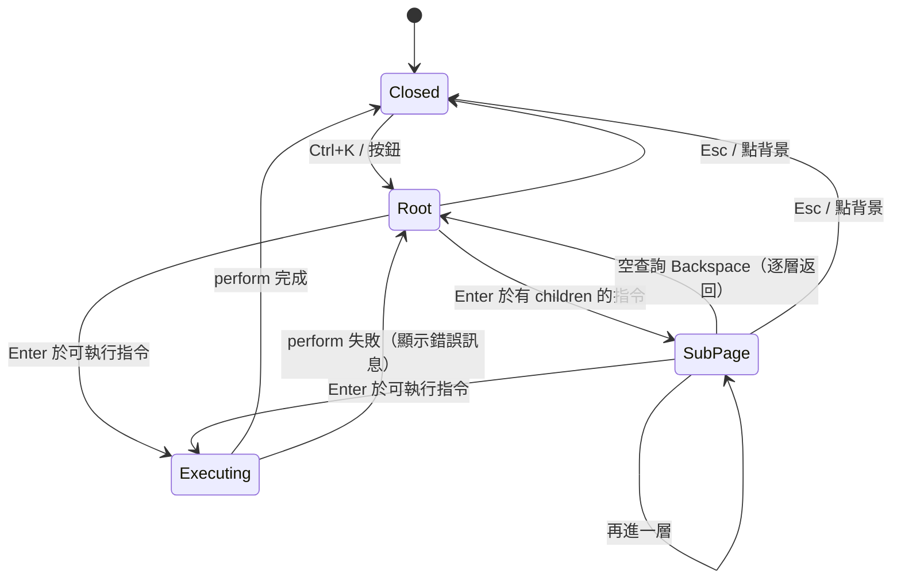
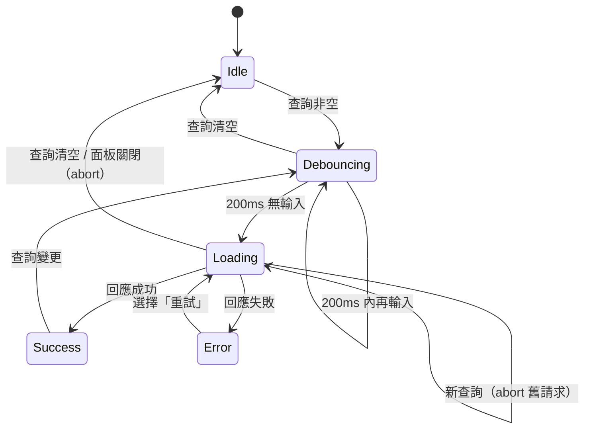

# PRD：指令面板（command-palette）

## 目標
展示類似 VS Code / Linear 的 `Ctrl+K` 指令面板：以 Fuse.js 模糊搜尋本地指令並高亮命中字元，合併非同步遠端結果（debounce + AbortController 丟棄過期回應），支援巢狀子頁與全域快捷鍵。重點在完整的 WAI-ARIA combobox 鍵盤互動、焦點管理與中文輸入法（IME）相容。

## 範圍
- **Must**
  - `Ctrl+K`（macOS 為 `⌘K`）與頁面按鈕開關面板；`Esc` 關閉；關閉後焦點回到開啟前的元素。
  - 使用原生 `<dialog>` + `showModal()`，背景 inert；開啟時鎖定 body 捲動。
  - Fuse.js 模糊搜尋 `title`（權重 0.7）與 `keywords`（權重 0.3），`threshold: 0.4`、`ignoreLocation: true`、`includeMatches: true`，以 `<mark>` 高亮命中字元。
  - 結果依群組顯示（導覽、外觀、動作、遠端結果）；有查詢時群組內依分數排序，空群組隱藏。
  - 巢狀子頁：帶 `children` 的指令按 `Enter` 進入子頁（例：外觀 › 切換主題 › 淺色／深色／跟隨系統），顯示麵包屑；查詢為空時按 `Backspace` 回上一層。
  - 鍵盤：`↑` / `↓` 移動（頭尾循環）、`Enter` 執行、`Tab` 不離開面板；active 項目自動 `scrollIntoView({ block: 'nearest' })`。
  - 最近使用：執行過的指令 id 存 `localStorage`（key `command-palette:recent`），最多 5 筆，查詢為空時顯示在最上方「最近使用」群組。
  - 非同步來源：模擬 API 搜尋文件，延遲 300–800ms，debounce 200ms，新查詢以 AbortController 取消舊請求；有 loading / error / 空結果狀態，error 時列表內提供「重試」選項。
  - 全域快捷鍵：指令可宣告 `shortcut`，支援組合鍵（`mod+shift+l`）與序列鍵（`g h`，兩鍵間隔 1000ms 內），面板關閉時也能觸發；項目右側顯示對應 `<kbd>`。
- **Should**
  - 示範頁右側顯示執行紀錄（最近 20 筆：時間、指令、觸發方式 palette / shortcut）。
  - 模擬 API 失敗率開關（0% / 30% / 100%），方便展示 error 與重試。
  - 壓力測試開關：額外加入 1,000 筆產生的指令，驗證搜尋效能。
  - 開關動畫（淡入 + 縮放 150ms），`prefers-reduced-motion` 時停用。
- **Won't**
  - 掛到 App 層做全站整合（只在示範頁內作用）。
  - 自寫模糊比對演算法（使用 Fuse.js）。
  - 使用者自訂快捷鍵、快捷鍵設定 UI。
  - 結果列表虛擬化（結果上限 50 筆即可，虛擬化另見 `virtual-list`）。

## 使用情境
- 身為使用者，我想要按 `Ctrl+K` 輸入「qhzt」找到「切換主題」，以便確認模糊搜尋與高亮。
- 身為使用者，我想要快速輸入時看遠端結果不會閃回舊資料，以便確認競態處理。
- 身為鍵盤／螢幕報讀器使用者，我想要只用鍵盤完成搜尋、進入子頁、執行指令，並聽到結果數量。
- 身為中文使用者，我想要用注音選字時按 `Enter` 只確認選字，不會誤執行指令。

## 狀態與流程
面板：


遠端搜尋：


## 資料與介面
- 相依套件：`fuse.js`（v7）。理由：模糊比對與評分不是本 demo 的展示重點，重點放在 combobox 互動、競態處理與快捷鍵；Fuse.js 無相依、gzip 約 7KB，且 `includeMatches` 直接提供高亮區間。
- 指令：
  ```ts
  interface Command {
    id: string
    title: string
    group: 'navigation' | 'appearance' | 'action' | 'remote'
    keywords?: string[]        // 例：['theme', 'dark', 'zhuti']
    shortcut?: string          // 'mod+shift+l' 或 'g h'
    disabled?: boolean
    perform?: (ctx: { source: 'palette' | 'shortcut' }) => void | Promise<void>
    children?: () => Command[] // 有則為子頁入口，與 perform 互斥
  }
  ```
- Composable：
  - `useCommandSearch(query: Ref<string>, commands: Ref<Command[]>) => { results: ComputedRef<SearchResult[]> }`，`SearchResult` 含 `command`、`score`、`matches: [start, end][]`。
  - `useRemoteSearch(query: Ref<string>, fetcher: (q: string, signal: AbortSignal) => Promise<Command[]>) => { status, results, error, retry }`。
  - `useRecentCommands(max = 5) => { ids, push(id), clear() }`。
  - `useShortcuts(bindings: Ref<ShortcutBinding[]>, options: { enabled: Ref<boolean> })`，unmount 時移除 listener。
  - `usePaletteNavigation(itemCount: Ref<number>) => { activeIndex, onKeydown, setActive }`。
- 元件：`CommandPalette.vue`（`v-model:open`，props `commands: Command[]`、`remoteFetcher?`；emit `execute(command, source)`）、`CommandItem.vue`、`HighlightText.vue`。

## 邊界情況
| 編號 | 情境 | 預期行為 |
|------|------|----------|
| EC-01 | 快速連續輸入 | 只送出 debounce 後最後一次請求，舊請求被 abort，過期回應不寫入結果 |
| EC-02 | IME 組字中按 `Enter` / `↑` / `↓` | `isComposing` 或 `keyCode === 229` 時不處理，不執行指令、不移動 active |
| EC-03 | 查詢無任何結果 | 顯示「找不到符合「xxx」的指令」，`aria-activedescendant` 移除，`Enter` 無動作 |
| EC-04 | 查詢只有空白 / 前後空白 | trim 後處理；純空白視為空查詢 |
| EC-05 | 查詢超長（> 100 字） | 輸入框 `maxlength=100`，不送遠端請求以外不報錯 |
| EC-06 | 結果變動後 active 超出範圍 | 查詢變更時 active 重設為第一個可用項目 |
| EC-07 | `disabled` 指令 | 顯示但 `aria-disabled="true"`，方向鍵跳過，`Enter` / 點擊無效 |
| EC-08 | 非同步 `perform` 執行中重複按 `Enter` | 只執行一次，項目顯示 loading，期間忽略輸入 |
| EC-09 | `perform` 拋錯 | 面板保持開啟，於列表上方顯示錯誤訊息（`role="alert"`），不寫入最近使用 |
| EC-10 | 最近使用 id 已不存在 | 載入時過濾掉，不顯示也不報錯 |
| EC-11 | `localStorage` JSON 損毀或不可用（無痕模式丟錯） | try/catch 後退回空陣列，功能照常，只是不保存 |
| EC-12 | 鍵盤移動使 list 捲動，滑鼠停在原地 | 以 `pointermove` 而非 `mouseenter` 更新 active，捲動不搶走 active |
| EC-13 | 焦點在 input / textarea / contenteditable 時按序列鍵 `g h` | 不觸發；`mod+` 組合鍵仍觸發 |
| EC-14 | 序列鍵第一鍵後超過 1000ms 或按了其他鍵 | 重置序列，不觸發 |
| EC-15 | 面板開啟中按全域快捷鍵 | 除 `mod+k`（關閉面板）外全部暫停 |
| EC-16 | 同一快捷鍵重複註冊 | 開發模式 `console.warn`，以先註冊者為準 |
| EC-17 | 開啟前焦點元素已被移除 | 關閉時焦點退回面板觸發按鈕 |
| EC-18 | 遠端請求進行中關閉面板 | abort 請求，重新開啟時狀態為 Idle |
| EC-19 | 查詢含 Fuse 特殊字元（`'`、`^`、`!`） | 未啟用 extended search，視為一般字元 |

## 非功能需求
- 效能：1,000 筆指令下每次按鍵搜尋 < 16ms（Fuse 索引只在 commands 變動時重建）；顯示結果上限 50 筆。
- 無障礙：
  - input：`role="combobox"`、`aria-expanded`、`aria-controls`、`aria-activedescendant`、`aria-autocomplete="list"`。
  - 列表：`role="listbox"`；群組 `role="group"` + `aria-labelledby`；項目 `role="option"` + `aria-selected`。
  - `aria-live="polite"` 區域宣告「N 個結果」與遠端載入狀態（debounce 後才宣告，避免洗版）。
  - 對話框 `aria-label="指令面板"`；快捷鍵以 `aria-keyshortcuts` 標示。
- RWD：寬度 ≥ 640px 時面板寬 560px、距頂 15vh；< 640px 時全寬貼頂，最小支援 360px；列表最大高度 `min(60vh, 400px)`。
- 平台：以 `navigator.userAgentData?.platform ?? navigator.platform` 判斷 macOS，`mod` 對應 `metaKey`，其餘對應 `ctrlKey`。

## 驗收標準
- [ ] AC-01：Given 面板關閉且焦點在任一按鈕，When 按 `Ctrl+K`，Then 面板開啟且焦點在 input；再按 `Esc`，Then 面板關閉且焦點回到原按鈕。
- [ ] AC-02：Given 面板開啟，When 輸入「qhzt」，Then「切換主題」出現在結果中且命中字元以 `<mark>` 包住。
- [ ] AC-03：Given 有 5 個結果且 active 在最後一個，When 按 `↓`，Then active 回到第一個，且 input 的 `aria-activedescendant` 等於該項目 id。
- [ ] AC-04：Given active 在「切換主題」，When 按 `Enter`，Then 進入子頁、麵包屑顯示「外觀 › 切換主題」、查詢清空；When 在空查詢按 `Backspace`，Then 回到上一層且 active 為「切換主題」。
- [ ] AC-05：Given 執行過「前往首頁」，When 重新開啟面板且查詢為空，Then「最近使用」群組第一筆為「前往首頁」；重新整理頁面後仍存在。
- [ ] AC-06：Given 遠端 API，When 在 200ms 內依序輸入「v」「vu」「vue」，Then fetcher 只被呼叫一次且參數為「vue」。
- [ ] AC-07：Given 「vu」的請求進行中，When 輸入「vue」，Then 舊請求的 signal 為 aborted，且較晚回來的「vu」回應不出現在結果中。
- [ ] AC-08：Given 失敗率 100%，When 查詢遠端，Then 顯示錯誤與「重試」選項；When 選擇「重試」，Then 重新發出請求。
- [ ] AC-09：Given 面板關閉、焦點在頁面空白處，When 依序按 `g`、`h`（間隔 < 1000ms），Then 執行「前往首頁」且執行紀錄來源為 shortcut。
- [ ] AC-10：Given 螢幕報讀器，When 輸入查詢且結果穩定，Then live region 文字為「N 個結果」。
- [ ] AC-11 ~ AC-29：邊界情況 EC-01 ~ EC-19 各自通過。
