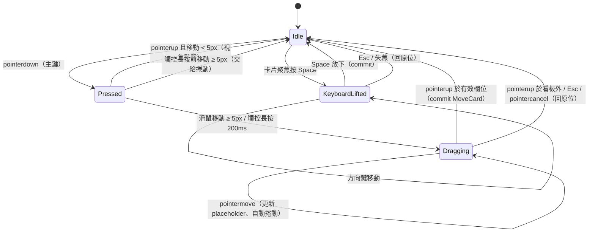
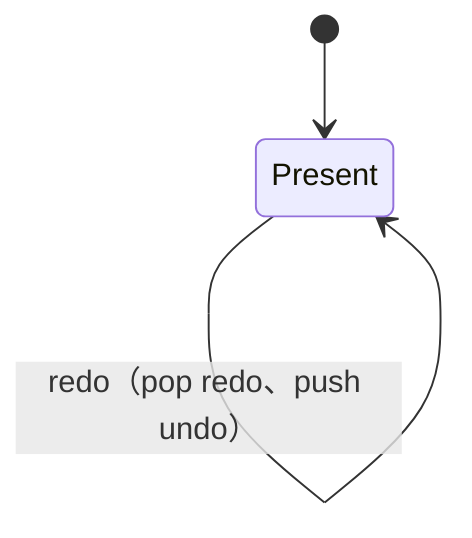

# PRD：拖放看板（kanban-board）

## 目標
展示類似 Trello / Linear 的看板：以 Pointer Events 自行實作拖放（同欄排序、跨欄移動、邊緣自動捲動），不依賴 HTML5 Drag and Drop，因此滑鼠、觸控、觸控筆行為一致。狀態集中在 Pinia store，所有變更走 command pattern，支援 Undo / Redo 與 `localStorage` 持久化。拖放同時提供完整鍵盤操作與螢幕報讀器宣告，補上目前專案缺少的「互動」與「狀態架構」兩個領域。

## 範圍
- **Must**
  - 3 欄預設看板（待辦、進行中、完成），每欄可新增、編輯標題、刪除卡片；預設種子資料 12 張卡片。
  - Pointer Events 拖放：`pointerdown` 後移動超過 5px 才進入拖曳（避免誤觸點擊）；觸控裝置長按 200ms 才進入拖曳，期間移動超過 5px 視為捲動並取消。
  - 拖曳中：原位置顯示同高度的 placeholder，被拖卡片以 `position: fixed` + `transform` 跟隨指標（`requestAnimationFrame` 節流，每幀最多更新一次）；以卡片中心點與目標欄各卡片中線比較決定插入索引。
  - 跨欄移動：指標進入另一欄時 placeholder 移到該欄；放開後卡片寫入新位置，放到看板外或按 `Esc` 取消並回到原位。
  - 邊緣自動捲動：指標距離欄位列表上下邊緣 48px 內時垂直捲動，距離看板左右邊緣 48px 內時水平捲動，速度與距離成反比，最大 16px / 幀。
  - 鍵盤拖放：卡片聚焦後按 `Space` 拿起；`↑` / `↓` 同欄移動，`←` / `→` 移到相鄰欄（保持相同索引，超出則放到最後）；`Space` 放下、`Esc` 取消。
  - 螢幕報讀器：`aria-live="assertive"` 宣告「已拿起：<標題>，位於 <欄> 第 N 張，共 M 張」、移動後的位置、放下或取消結果。
  - Undo / Redo：新增、編輯、刪除、移動皆為 command（`do` / `undo`），`Ctrl+Z` / `Ctrl+Shift+Z`（macOS 為 `⌘`）與按鈕觸發；歷史上限 50 筆，執行新 command 時清空 redo 堆疊。
  - 持久化：store 變更後 debounce 300ms 寫入 `localStorage`（key `kanban-board:v1`），重新整理後還原；歷史紀錄不持久化。
- **Should**
  - 跨分頁同步：以 `BroadcastChannel('kanban-board')` 廣播變更，其他分頁即時更新；不支援時退回 `storage` event。
  - 放下動畫：卡片從指標位置以 FLIP 動畫滑到最終位置 200ms；`prefers-reduced-motion` 時停用。
  - 欄位 WIP 上限：「進行中」預設上限 3 張，超過時該欄外框轉為警告色並拒絕放入（placeholder 不出現）。
  - 「重設看板」按鈕：還原種子資料並清空歷史。
- **Won't**
  - 使用 HTML5 Drag and Drop API 或第三方拖放函式庫（`sortablejs`、`vuedraggable`）。
  - 新增、刪除、拖曳排序「欄」本身（欄位固定 3 個）。
  - 多選卡片一起拖曳。
  - 後端同步、多人即時協作、衝突合併。
  - 卡片內容虛擬化（每欄上限 100 張即可）。

## 使用情境
- 身為面試官，我想要用滑鼠把卡片拖到另一欄的中間，以便確認插入位置計算正確。
- 身為面試官，我想要在手機上長按拖曳卡片，同時仍能正常上下捲動欄位。
- 身為鍵盤／螢幕報讀器使用者，我想要不用滑鼠完成拿起、移動、放下，並聽到目前位置。
- 身為使用者，我想要誤刪卡片後按 `Ctrl+Z` 還原，以便不怕操作失誤。

## 狀態與流程
拖曳：


歷史紀錄：


## 資料與介面
- 相依套件：無新增，使用現有 `pinia`。
- 資料：
  ```ts
  type ColumnId = 'todo' | 'doing' | 'done'
  interface Card { id: string; title: string; createdAt: number }
  interface BoardState {
    cards: Record<string, Card>
    columns: Record<ColumnId, string[]>   // 欄內卡片 id 的順序
  }
  interface Command {
    label: string                          // 供宣告與 tooltip：「移動『修 bug』到完成」
    do(state: BoardState): void
    undo(state: BoardState): void
  }
  ```
- Store：`useBoardStore()`（setup store），state 為 `board: BoardState` 與 `past` / `future: BoardCommand[]`；actions `execute(cmd)`、`undo()`、`redo()`、`replace(state)`（重設、還原、壓力測試，同時清空歷史）與 `addCard` / `editCard` / `removeCard` / `moveCard`；getters `canUndo`、`canRedo`、`nextUndo`、`nextRedo`。
- Command 工廠（`utils/commands.ts`）：`addCardCommand(card, column)`、`editCardCommand(id, from, to)`、`removeCardCommand(card, from)`、`moveCardCommand(card, from, to)`；`to.index` 為卡片移除後在目標欄的索引。
- Composable：
  - `usePointerDrag(root, options: { resolve, onStart, onMove, onEnd, onCancel, touchDelay?: number, threshold?: number }) => { isDragging, cancel }`，pointer capture 設在不會被移除的看板容器上，unmount 時移除 listener 與取消 rAF。
  - `utils/geometry.ts`：`measureBoard(board, gapId)` 量測卡片中線（內容座標，扣掉被拖卡片或 placeholder 佔的高度）、`refreshScroll(geometry, board)` 捲動後只更新容器位置與 scrollTop、`resolveDrop(geometry, point) => CardPosition | null`（純函式）。
  - `useBoardDrag(scroller, store, options) => { drag, pointer, cancel }`：串起手勢、量測、自動捲動，放下時呼叫一次 `store.moveCard`。
  - `useAutoScroll(getTargets: () => { el, axis }[], { edge = 48, maxSpeed = 16 }) => { update(point), stop() }`，速度計算抽成純函式 `edgeSpeed`。
  - `useKeyboardDrag(store, { announce, focusCard }) => { lifted, displayColumns, lift, move, drop, cancel }`；位置計算為純函式 `stepPosition`。
  - `useHistoryShortcuts({ isMac, onUndo, onRedo })`。
  - `usePersistedBoard(store, key = 'kanban-board:v1')`。
- 元件：`KanbanBoard.vue`、`KanbanColumn.vue`、`KanbanCard.vue`、`DragGhost.vue`（Teleport 到 body）。

## 邊界情況
| 編號 | 情境 | 預期行為 |
|------|------|----------|
| EC-01 | 點擊卡片（移動 < 5px） | 不進入拖曳，進入編輯或聚焦，不產生 command |
| EC-02 | 放回原位置（同欄同索引） | 不產生 command，undo 堆疊不變 |
| EC-03 | 拖曳中按 `Esc` 或觸發 `pointercancel`（例如來電、切換分頁） | 取消拖曳，卡片回原位，不產生 command |
| EC-04 | 拖曳到空欄 | placeholder 顯示在空欄頂部，放下後索引為 0 |
| EC-05 | 拖曳中另一根手指觸碰或按下第二個指標 | 忽略非 `pointerId` 相符的事件 |
| EC-06 | 非主鍵（右鍵、中鍵）按下 | `button !== 0` 不進入拖曳 |
| EC-07 | 拖曳中自動捲動導致卡片位置改變 | 捲動後重新量測並以最後指標位置重算插入索引 |
| EC-08 | 拖曳中視窗 resize | 重新量測目標位置，不中斷拖曳 |
| EC-09 | 同欄往下移動 | 插入索引扣除原卡片自身（移除後再插入），不會多偏移一格 |
| EC-10 | 鍵盤拿起後在第一張按 `↑`、在最左欄按 `←` | 位置不變，宣告「已在最上方」／「已在最左欄」 |
| EC-11 | 鍵盤拿起狀態下焦點離開卡片 | 視同取消，回原位並宣告 |
| EC-12 | undo 堆疊為空時按 `Ctrl+Z` | 無動作，按鈕 `disabled` |
| EC-13 | 歷史超過 50 筆 | 丟棄最舊一筆 |
| EC-14 | undo 後執行新操作 | redo 堆疊清空 |
| EC-15 | 焦點在標題編輯 input 中按 `Ctrl+Z` | 交給瀏覽器原生文字 undo，不觸發看板 undo |
| EC-16 | 新增卡片標題為空或只有空白 | 不新增，input 顯示錯誤訊息；標題上限 100 字 |
| EC-17 | 刪除正在編輯的卡片後 undo | 卡片回到原欄原索引，內容與 id 不變 |
| EC-18 | `localStorage` JSON 損毀、schema 不符或不可用 | try/catch 後退回種子資料，功能照常，只是不保存 |
| EC-19 | 儲存資料中欄位引用不存在的卡片 id | 載入時過濾掉，重複 id 只保留第一個 |
| EC-20 | 拖曳中卡片被其他分頁刪除（Should） | 取消拖曳並宣告「卡片已被移除」 |
| EC-21 | 拖曳時頁面選取文字、觸控時頁面跟著捲動 | 拖曳中 body `user-select: none`；進入拖曳後以非 passive 的 `touchmove` 呼叫 `preventDefault()` 阻止捲動（`touch-action` 在手勢中途修改不會生效），長按前不阻止 |

## 非功能需求
- 效能：每欄 100 張、共 300 張卡片時，拖曳期間維持 60fps（每幀 JS < 8ms）；拖曳中不觸發 store 更新，只在放下時 commit 一次；卡片位置只在拖曳開始與 resize 時量測，捲動時只讀容器位置與 scrollTop，`pointermove` 內不讀版面。
- 無障礙：
  - 看板 `role="region"` + `aria-label`；欄位為 `<section>` + 標題 `<h2>`，卡片列表為 `<ul>`、卡片為 `<li>` 內含可聚焦按鈕。
  - 卡片 `aria-describedby` 指向操作說明「按 Space 拿起，方向鍵移動，Space 放下，Esc 取消」；卡片按鈕 `aria-roledescription="可拖曳的卡片"`，拿起狀態以 live region 宣告（不用已棄用的 `aria-grabbed`）。
  - `aria-live="assertive"` 宣告拿起、移動、放下、取消與 undo / redo 的 command label。
  - 焦點在移動、undo、redo 後保持在同一張卡片上；卡片被刪除時焦點移到同欄下一張，沒有則到欄位的「新增」按鈕。
- RWD：寬度 ≥ 768px 三欄並排；< 768px 欄位水平排列、每欄寬 85vw、`scroll-snap-type: x mandatory`，最小支援 360px；觸控目標至少 44×44px。

## 驗收標準
- [ ] AC-01：Given 「待辦」有 A、B、C，When 以指標把 A 拖到 B 與 C 之間放下，Then 順序為 B、A、C，且 undo 堆疊多一筆。
- [ ] AC-02：Given 「待辦」有 A、「完成」有 X、Y，When 把 A 拖到「完成」的 X 與 Y 之間，Then 「完成」為 X、A、Y，「待辦」不含 A。
- [ ] AC-03：Given 拖曳中，When 按 `Esc`，Then 卡片回到原位置且 store 未變更。
- [ ] AC-04：Given 拖曳中指標停在欄位列表底部邊緣 48px 內，When 經過數幀，Then 列表 `scrollTop` 持續增加且不超過 16px / 幀。
- [ ] AC-05：Given 觸控裝置，When 按住卡片 150ms 內移動 10px，Then 不進入拖曳且頁面可捲動；When 按住 200ms 後移動，Then 進入拖曳。
- [ ] AC-06：Given 焦點在「待辦」第 1 張，When 依序按 `Space`、`→`、`↓`、`Space`，Then 卡片位於「進行中」第 2 張，live region 宣告最終位置，焦點仍在該卡片。
- [ ] AC-07：Given 完成一次移動，When 按 `Ctrl+Z`，Then 卡片回原位；When 按 `Ctrl+Shift+Z`，Then 卡片再次到移動後位置。
- [ ] AC-08：Given 刪除卡片 B，When 重新整理頁面，Then B 仍不存在；When 按 `Ctrl+Z`，Then 無動作（歷史不持久化）。
- [ ] AC-09：Given 300 張卡片，When 拖曳 5 秒，Then Performance 面板無超過 16ms 的 long frame，且拖曳期間 store 未更新。
- [ ] AC-10：Given 兩個分頁開啟看板（Should），When 在分頁 A 移動卡片，Then 分頁 B 在 300ms 內顯示相同順序。
- [ ] AC-11 ~ AC-31：邊界情況 EC-01 ~ EC-21 各自通過。
