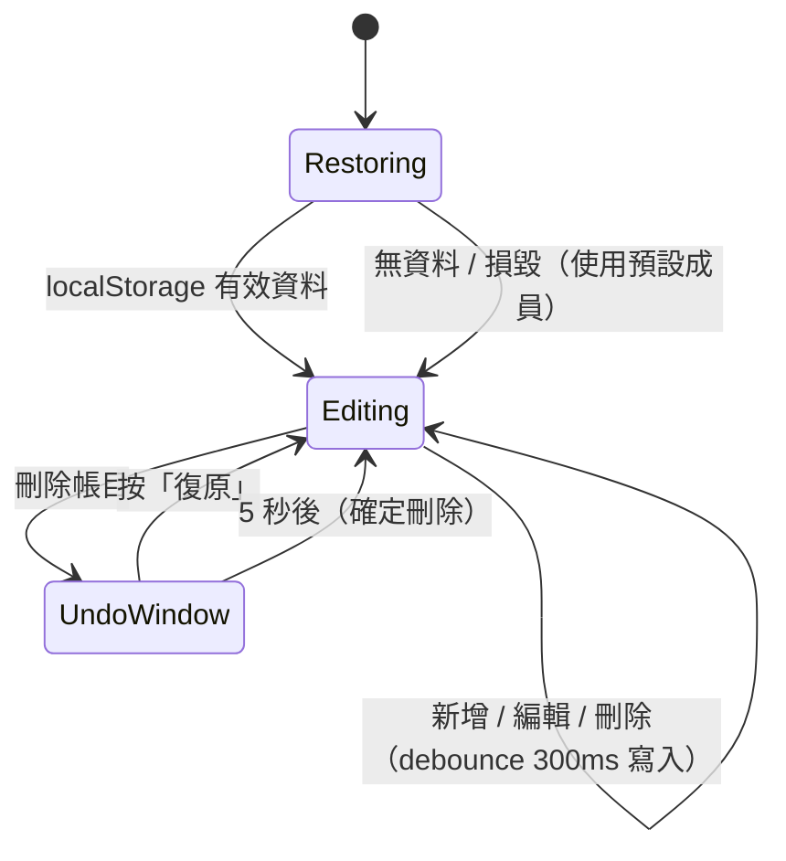

# PRD：聚餐分帳（split-bill）

## 目標
朋友聚餐、出遊常見的「誰先墊、每人該出多少、最後誰轉給誰」。展示金額計算的正確做法：金額以整數處理、除不盡時以最大餘數法分配、保證加總等於總額；支援平分、指定金額、按份數三種分法與 10% 服務費；以貪婪法算出轉帳筆數不超過「人數 − 1」的結算清單。金額欄位可輸入簡單算式（`120+85*2`），以自寫的遞迴下降解析器計算，不使用 `eval`。

## 關鍵決策
| 決策 | 選擇 | 理由 |
| --- | --- | --- |
| 金額單位 | 新台幣整數元，內部全部是整數 | 避免 `0.1 + 0.2`；台灣聚餐分帳實務上不找角 |
| 除不盡 | 最大餘數法（Hamilton）：先各自無條件捨去，剩下的 1 元依小數部分由大到小分配，相同時依成員順序 | 加總一定等於總額，結果可重現 |
| 結算演算法 | 貪婪：每次讓最大債權人與最大債務人配對 | 轉帳數 ≤ n − 1；最少轉帳數為 NP-hard，面試可說明取捨 |
| 算式輸入 | 自寫 tokenizer + 遞迴下降解析器，支援全形數字與符號 | 中文輸入法常打出全形；不用 `eval` / `Function` |
| 狀態 | 單一 composable `useSplitBill`（不用 Pinia） | 只有此 feature 使用 |

## 範圍
- **Must**
  - 成員：新增（名稱 1–12 字、不可重複，去除前後空白後比較，不分大小寫）、改名、刪除；人數 2–20。有相關帳目的成員不可刪除，顯示原因。預設「我、小明、小華」。
  - 帳目：名稱（1–30 字）、付款人、金額（算式，結果需為 1–1,000,000 的數字，四捨五入到整數元）、是否加 10% 服務費（服務費四捨五入到整數元，加在總額上再分）、分法：
    - 平分：勾選參與者（至少 1 人），最大餘數法分配。
    - 指定金額：每位參與者輸入金額；加總必須等於總額，否則顯示差額「還差 NT$30」/「超過 NT$30」並不能儲存。
    - 按份數：每人份數 0–10 的整數（例如大人 2、小孩 1），總份數至少 1，按比例以最大餘數法分配。
  - 帳目列表：名稱、付款人、總額、分法摘要；可編輯、刪除；刪除後 5 秒內可「復原」。
  - 結算：每人「已付 / 應付 / 差額」表，差額正數顯示「應收」、負數「應付」；轉帳清單「小明 → 我 NT$450」；全部結清時顯示「大家都結清了」。
  - 複製結算文字到剪貼簿（`navigator.clipboard.writeText`，不可用時退回隱藏 `textarea` + `execCommand('copy')`），結果以 live region 宣告。
  - 持久化：`localStorage` key `split-bill:v1`，格式 `{ version: 1, data }`；變更後 debounce 300ms 寫入，`pagehide` 時補存；解析失敗或版本不符時回到預設資料，資料內容逐筆驗證，不合法的帳目丟棄。
  - 「清空重來」需確認（`confirm`）。
- **Should**
  - 金額輸入時即時顯示算式結果預覽「= NT$1,234」。
  - （未實作）結算以「四捨五入到 10 元」選項產生較好轉的金額。
- **Won't**
  - 多幣別與匯率、多人同時編輯、帳號與雲端同步、收據拍照辨識。

## 使用情境
- 身為聚餐的主揪，我想要記下每筆是誰先付的，以便吃完直接知道誰要轉給誰。
- 身為帶小孩的家長，我想要按份數分（大人 2、小孩 1），以便分得公平。
- 身為用手機記帳的人，我想要直接輸入 `1280+350`，以便不用另外開計算機。
- 身為面試官，我想要看到 1000 元三人平分的結果，以便確認總和仍是 1000。

## 狀態與流程


## 資料與介面
- 型別：
  ```ts
  interface Member { id: string; name: string }
  type Split =
    | { mode: 'equal'; participants: string[] }
    | { mode: 'exact'; amounts: Record<string, number> }
    | { mode: 'shares'; shares: Record<string, number> }
  interface Expense { id: string; title: string; payerId: string; amount: number; serviceCharge: boolean; split: Split }
  interface Transfer { from: string; to: string; amount: number }
  ```
- 純函式：
  - `utils/money.ts`：`allocate(total, weights) => number[]`（最大餘數法）、`formatTwd(amount)`。
  - `utils/expression.ts`：`evaluate(text) => { ok: true; value } | { ok: false; error }`，支援 `+ - * / ( )`、小數、一元負號、全形字元與千分位逗號；除以 0、語法錯誤回傳錯誤訊息。
  - `utils/split.ts`：`expenseTotal(expense)`、`owedBy(expense) => Map<memberId, number>`、`validateExpense(draft, members) => string[]`、`computeBalances(members, expenses) => Balance[]`、`settle(balances) => Transfer[]`、`summaryText(...)`。
  - `utils/storage.ts`：`parseSaved(raw) => SavedState | null`。
- Composable：
  - `useSplitBill(options?: { storage?, saveDelay? })`：`members`、`expenses`、`balances`、`transfers`、`addMember`、`renameMember`、`removeMember`、`saveExpense`、`removeExpense`、`undoRemove`、`reset`。
  - `useClipboard() => { copy(text): Promise<boolean> }`。
- 元件：`SplitBillApp.vue`、`MemberList.vue`、`ExpenseForm.vue`、`ExpenseList.vue`、`SettlementPanel.vue`。

## 邊界情況
| 編號 | 情境 | 預期行為 |
|------|------|----------|
| EC-01 | 1000 元 3 人平分 | 334 / 333 / 333，加總 1000；多出的 1 元給成員順序在前者 |
| EC-02 | 份數 2 : 1 : 1 分 1001 元 | 501 / 250 / 250 |
| EC-03 | 指定金額加總不等於總額 | 顯示差額，儲存按鈕停用 |
| EC-04 | 服務費：1234 元加 10% | 服務費 123，總額 1357 |
| EC-05 | 算式 `１２０＋８０`（全形）、`1,200+300`、`(100+50)*2` | 分別為 200、1500、300 |
| EC-06 | 算式 `100/0`、`1++`、`abc`、空白、負數結果 | 顯示錯誤訊息，不能儲存 |
| EC-07 | 算式結果有小數（`100/3`） | 四捨五入為 33 |
| EC-08 | 新增重複名稱（含大小寫與前後空白差異） | 顯示「已有同名成員」 |
| EC-09 | 刪除有帳目的成員 | 不刪除，顯示「XX 有相關帳目，請先修改帳目」 |
| EC-10 | 刪除帳目後 5 秒內按復原 | 帳目回到原位置 |
| EC-11 | 刪除帳目後 5 秒內又刪另一筆 | 前一筆直接確定刪除，復原只作用於最後一筆 |
| EC-12 | 沒有帳目或全部結清 | 顯示「大家都結清了」，沒有轉帳 |
| EC-13 | 付款人不在參與者中 | 允許（幫別人付），付款人差額為正 |
| EC-14 | `localStorage` 損毀、版本不符、成員 id 不存在的帳目 | 捨棄不合法部分，不拋錯 |
| EC-15 | 連續快速編輯 | debounce 後只寫入一次；`pagehide` 補存 |
| EC-16 | `navigator.clipboard` 不可用或被拒 | 退回 `execCommand`；仍失敗時顯示「複製失敗，請手動選取」 |
| EC-17 | 平分時沒有勾選任何人 / 份數總和為 0 | 顯示錯誤，不能儲存 |
| EC-18 | unmount | 清除 debounce 與復原計時器、移除 `pagehide` listener，並補存 |

## 非功能需求
- 效能：20 人、500 筆帳目時結算計算 < 5ms。
- 無障礙：表單欄位有 `label`；錯誤以 `aria-invalid` + `aria-describedby` 連結；分法切換為 radio；刪除、復原、複製結果以 `role="status"` 宣告；所有按鈕有可辨識名稱（「刪除『晚餐』」）。
- RWD：≥ 900px 左欄成員與帳目、右欄結算；< 900px 上下排列；最小寬度 360px。

## 驗收標準
- [ ] AC-01：Given 3 位成員，When 新增「晚餐」1000 元由「我」付、平分，Then 應付為 334 / 333 / 333，轉帳為「小明 → 我 NT$333」「小華 → 我 NT$333」。
- [ ] AC-02：Given 金額輸入 `1280+350`，Then 預覽顯示 NT$1,630 且可儲存。
- [ ] AC-03：Given 指定金額 400 + 500 但總額 1000，Then 顯示「還差 NT$100」且儲存按鈕停用。
- [ ] AC-04：Given 任意帳目組合，Then 所有人差額加總為 0，且轉帳數 ≤ 人數 − 1、執行轉帳後每人差額歸零。
- [ ] AC-05：Given 刪除一筆帳目，When 5 秒內按復原，Then 帳目回到列表；When 超過 5 秒，Then 復原按鈕消失。
- [ ] AC-06：Given 有資料，When 重新載入，Then 資料還原；When 儲存內容損毀，Then 回到預設成員且不拋錯。
- [ ] AC-07：Given 按「複製結算」，Then 剪貼簿內容包含每筆轉帳文字，並宣告「已複製」。
- [ ] AC-08 ~ AC-25：邊界情況 EC-01 ~ EC-18 各自通過。
