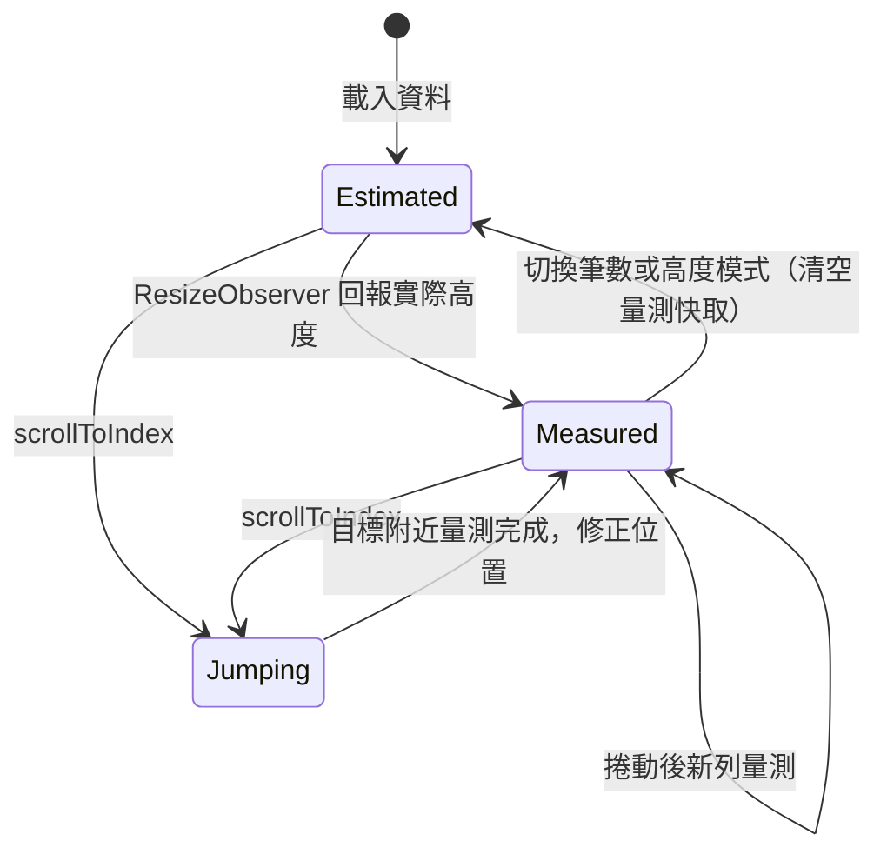

# 虛擬列表 規格

## 目標
展示在 10 萬筆資料下只渲染可視範圍的 DOM，讓捲動維持 60fps。同時支援固定高度（O(1) 定位）與動態高度（預估、量測、前綴和、二分搜尋）兩種模式，並提供與 naive 全量渲染的切換比較，讓效能差異可以直接被看見。

## 範圍
- **Must**
  - 固定高度模式與動態高度模式，可切換。
  - 資料筆數可調：1,000 / 10,000 / 100,000。
  - naive 模式（全部渲染）與 virtual 模式切換；naive 模式最多 10,000 筆。
  - 即時指標：FPS、目前 DOM 列數、可視範圍的起訖索引。
  - `scrollToIndex(index, align)`：輸入索引後跳轉，`align` 支援 `start` / `center` / `end`。
  - 鍵盤導覽：上下鍵、`Home` / `End`、`PageUp` / `PageDown` 移動選取項目。
- **Should**
  - 選取項目在切換高度模式或筆數後保留（索引仍存在時）。
  - 捲動時在 overscan 區外的空白區顯示 skeleton 佔位。
- **Won't**
  - 水平虛擬化、網格（grid）虛擬化。
  - 無限載入（另見 `infinite-scroll`）。
  - 使用第三方虛擬列表套件。

## 使用情境
- 身為面試官，我想要切換 naive 與 virtual 模式並捲動 10,000 筆資料，以便親眼比較 FPS 與 DOM 數量。
- 身為面試官，我想要在動態高度模式下跳到第 50,000 筆，以便確認位置計算正確。
- 身為鍵盤使用者，我想要用方向鍵瀏覽列表，以便不用滑鼠操作。

## 狀態與流程

## 資料與介面
- 資料：`interface ListItem { id: number; title: string; body: string }`，本地產生；動態模式下 `body` 長度 0–300 字隨機，用固定 seed 確保每次結果相同。
- 元件：`VirtualList<T>`（泛型元件）
  - Props：`items: readonly T[]`、`itemKey: (item, index) => string | number`、`label: string`（無障礙名稱）、`itemHeight?: number`（有值為固定模式）、`estimatedHeight?: number`（預設 48）、`overscan?: number`（預設 5）
  - Model：`v-model:selected`（`number | null`）
  - Emits：`rangeChange: [range: VirtualRange]`（`{ start, end, renderStart, renderEnd }`）
  - Slot：`#default="{ item, index, selected }"`
  - Expose：`scrollToIndex(index: number, align?: 'start' | 'center' | 'end'): void`
- 版面策略（`utils/layout.ts`，純函式可單獨測試）：
  - `Layout` 介面：`offsetOf`、`sizeOf`、`indexAt`、`measure`、`totalHeight`。
  - `createFixedLayout`：乘除法 O(1)。
  - `createDynamicLayout`：高度存於 `Float64Array`，位置用延遲計算的前綴和，`indexAt` 用二分搜尋。
  - `computeRange`、`scrollOffsetFor`：計算可視範圍與跳轉目標。
- Composable：
  - `useVirtualList(viewport, { count, itemHeight, estimatedHeight, overscan }) => { range, totalHeight, windowOffset, isDynamic, scrollToIndex }`：依 `itemHeight` 選擇版面策略，處理捲動、量測、scroll anchoring 與跳轉修正。
  - `useFps() => { fps }`：以 `requestAnimationFrame` 計算，每 500ms 更新一次。
  - `useRenderTiming(source) => { duration }`：量測切換模式到繪製完成的時間。

## 邊界情況
| 編號 | 情境 | 預期行為 |
|------|------|----------|
| EC-01 | 資料為空陣列 | 顯示「沒有資料」，不渲染列，總高度為 0 |
| EC-02 | 資料筆數少於一屏 | 全部渲染，無捲軸，範圍為 `[0, length - 1]` |
| EC-03 | `scrollToIndex` 參數超出範圍或為負數 | 夾在 `[0, length - 1]` 內，不拋錯 |
| EC-04 | 動態模式跳到尚未量測的遠處索引 | 先以預估高度跳轉，量測後修正，最終目標列完整出現在可視區 |
| EC-05 | 可視區上方的列量測後高度改變 | 修正 `scrollTop`，畫面內容不跳動（scroll anchoring） |
| EC-06 | 快速拖曳捲軸到底部 | 最後一筆完整顯示，底部無多餘空白 |
| EC-07 | 容器尺寸改變（視窗縮放、RWD） | 以 ResizeObserver 重新計算可視範圍 |
| EC-08 | 切換筆數或高度模式 | 清空量測快取，捲回頂部，選取項目超出範圍時清除 |
| EC-09 | 在 naive 模式選 100,000 筆 | 選項停用並提示上限 10,000，避免頁面卡死 |
| EC-10 | 鍵盤移動到可視區外的項目 | 自動捲動使該項目可見，並保持在 DOM 中 |
| EC-11 | 元件卸載 | 取消 rAF、斷開 ResizeObserver、移除 listener |

## 非功能需求
- 效能：virtual 模式 100,000 筆時，DOM 列數不超過「可視列數 + 2 × overscan」；在桌機 Chrome 快速捲動時 FPS ≥ 55。首次渲染時間 < 100ms（不含資料產生）。
- 效能：捲動處理不觸發 Vue 深層響應式；資料陣列用 `shallowRef` 或 `markRaw`。
- 無障礙：容器 `role="listbox"` 並可取得焦點（`tabindex="0"`），列為 `role="option"`，帶 `aria-setsize`、`aria-posinset`、`aria-selected`；以 `aria-activedescendant` 指向目前選取項目。
- RWD：最小寬度 360px 可操作；指標面板在窄螢幕移到列表上方。

## 驗收標準
- [ ] AC-01：Given 固定高度 100,000 筆，When 捲動到 `scrollTop = 48 × 1000`，Then 可視範圍起始索引為 1000（扣除 overscan 前）。
- [ ] AC-02：Given virtual 模式 100,000 筆，When 捲動任意位置，Then DOM 中的列數不超過可視列數 + 10。
- [ ] AC-03：Given 動態高度模式，When 呼叫 `measure` 更新某列高度，Then 該列之後所有列的 `offsetOf` 同步改變，之前的列不變。
- [ ] AC-04：Given 動態高度模式 100,000 筆，When `scrollToIndex(50000, 'start')`，Then 第 50,000 列頂端與容器頂端對齊，誤差 ≤ 1px。
- [ ] AC-05：Given 任一模式，When `scrollToIndex` 使用 `center` / `end`，Then 目標列分別對齊容器中央與底部。
- [ ] AC-06：Given 列表有焦點且選取第 0 筆，When 依序按 `ArrowDown`、`End`、`Home`，Then 選取索引依序為 1、最後一筆、0，且 `aria-activedescendant` 同步更新。
- [ ] AC-07：Given naive 模式 10,000 筆，When 切換到 virtual 模式，Then DOM 列數明顯下降，指標面板即時更新。
- [ ] AC-08：邊界情況 EC-01 至 EC-11 通過。
